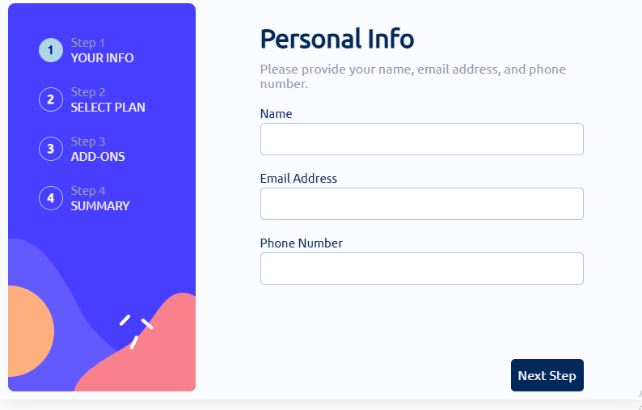

Frontend Mentor - Multi-step form solution

This is a solution to the Multi-step form challenge on Frontend Mentor. Frontend Mentor challenges help you improve your coding skills by building realistic projects.
Table of contents

    Frontend Mentor - Multi-step form solution
      - Table of contents
      - Overview
        - The challenge
        - Screenshot
        - Links
      - My process
        - Built with
        - What I learned
        - Continued development
        - Useful resources
      - Author
      - Acknowledgments

Overview
The challenge

Users should be able to:

    Complete each step of the sequence

    Go back to a previous step to update their selections

    See a summary of their selections on the final step and confirm their order

    View the optimal layout for the interface depending on their device's screen size

    See hover and focus states for all interactive elements on the page

    Receive form validation messages if:
      - A field has been missed
      - The email address is not formatted correctly
      - A step is submitted, but no selection has been made

Screenshot

Links

    Solution URL: Add solution URL here

    Live Site URL: Add live site URL here

My process
Built with

    Semantic HTML5 markup

    CSS custom properties

    Flexbox

    CSS Grid

    Plain JS

What I learned

What I have learned most is the importance of building experience and planning every element, design and functionality in advance. As by proper planning and following through with a systematic approach you can complete the projects in time and in an expected manner
Continued development

The thing I would like to continue developing on is overall workflow and planning with added technical knowledge and building better practice and foundation.
Useful resources

I would say mozilla documentation is useful resource.
Author

    Website - Ahmed Fuad

    Frontend Mentor - @yAFuad-tech

Acknowledgments

This project is done personally by me without the help of anyone. By doing this myself I challenged myself a lot and learned many things which I know will be essential when I work as a front end dev.
